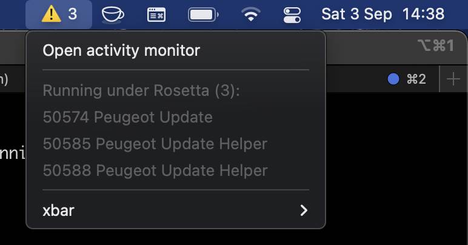

# Rosetta Warn

Plugin for [xbar](https://github.com/matryer/xbar) that displays a warning icon on your OSX status bar when applications are running under Rosetta, and outputs the processes in a menu. 




Useful if you want to keep an eye on what is running, especially if battery life is a concern.

## Pre-requisites

- Apple Silicon Mac 
- [xbar](https://github.com/matryer/xbar) is installed

## Installation 

```
$ cp rosetta-warn.1m.sh  ~/Library/Application\ Support/xbar/plugins/
```
